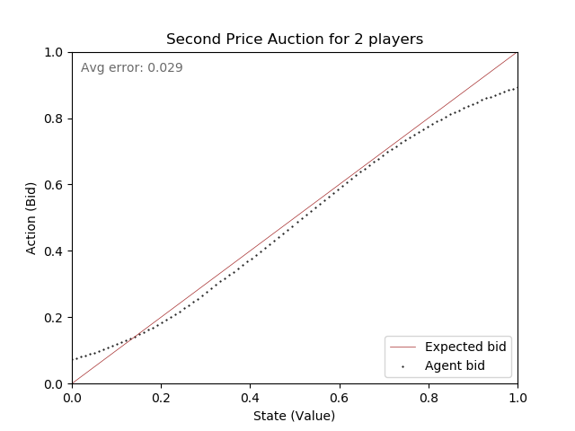

# Deep Reinforcement Learning in Auction Theory 
Multiagent auction simulation using deep reinforcement learning algorithms

#### INF - PhD Conclusion Project
Conclusion project of postgraduate program at the Department of Informatics of PUC-Rio.

## Installation and Execution

#### Installing in Anaconda environment

We can use Anaconda to set an environment.

```bash
conda create -n <environment_name> python=3.7.6
conda activate <environment_name>
```

#### Install the dependencies of the project through the command

Then, locate the project's root directory and use pip to install the requirements (`requirements.txt`).

```bash
pip install -r requirements.txt
```

#### To execute the program, just type the following line on the root directory 

```bash
python src/main.py -a <type of auction> -b <batch size> -d <load trained models> -e <number of episodes> -n <number of players> -p   <ponderated average size> -r <aversion coefficient> -s <save test results in a plot> -t <use alert .mp3 file> -z <number of executions> 
```
where the arguments may be passed after the __main.py__ call, as described above, otherwise the default parameters will be selected.

## Some results

+ Auction: First price
+ Players: 2
+ Risk aversion: 1
+ Episodes: 30k


+ Auction: Second price
+ Players: 2
+ Risk aversion: 1
+ Episodes: 10k



## Acknowledgement

This algorithm development is based on the OpenAI's DDPG algorithm. The code is inherit by [DDPG](https://github.com/openai/baselines/blob/master/baselines/ddpg/ddpg.py).
